# Near Stake Wariii

**本文介绍了如何进行 Near 最近开启的 7.22-0909 的第三个 Stake war 的钱包申请与节点构建**

# 硬件准备：

截至 20220811，当前项目方推荐至少 16G 内存的服务器进行本次质押大战。我这边刚开始使用的是 4c+8g+500G 的服务器，在挑战后期由于竞争愈发激烈已经升级到了 8c+32g+500G。仅供参考

# 一，钱包的生成（Create your Shardnet wallet）

**Wallet: [https://wallet.shardnet.near.org/](https://wallet.shardnet.near.org/)**

**打开上述链接**

1. 创建新的账户：

   ****

2. 推荐选择以助记词的方式生成：

   一定要记住此处的助记词，这是之后操作钱包最重要的凭证，建议手写保持良好习惯。

   ****

   ****

3. 验证助记词获得账户：

   ****

****

****

# 二，配置节点服务并同步网络

 [Setup a validator and sync it to the actual state of the network.](https://github.com/near/stakewars-iii/blob/main/challenges/002.md)

### 依赖安装

1. 确保硬件设备支持

   ```bash
   lscpu | grep -P '(?=.*avx )(?=.*sse4.2 )(?=.*cx16 )(?=.*popcnt )' > /dev/null \
   && echo "Supported" \
   || echo "Not supported"
   ```

   如果输出：Supported 代表硬件支持可以进行后续步骤。

   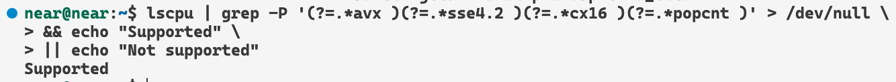

2. 安装依赖：

   ```bash
   sudo apt install -y git binutils-dev libcurl4-openssl-dev zlib1g-dev libdw-dev libiberty-dev cmake gcc g++ python docker.io protobuf-compiler libssl-dev pkg-config clang llvm cargo
   sudo apt install -y python3-pip
   ```

3. 配置环境变量

   ```bash
   USER_BASE_BIN=$(python3 -m site --user-base)/bin
   export PATH="$USER_BASE_BIN:$PATH"
   ```

   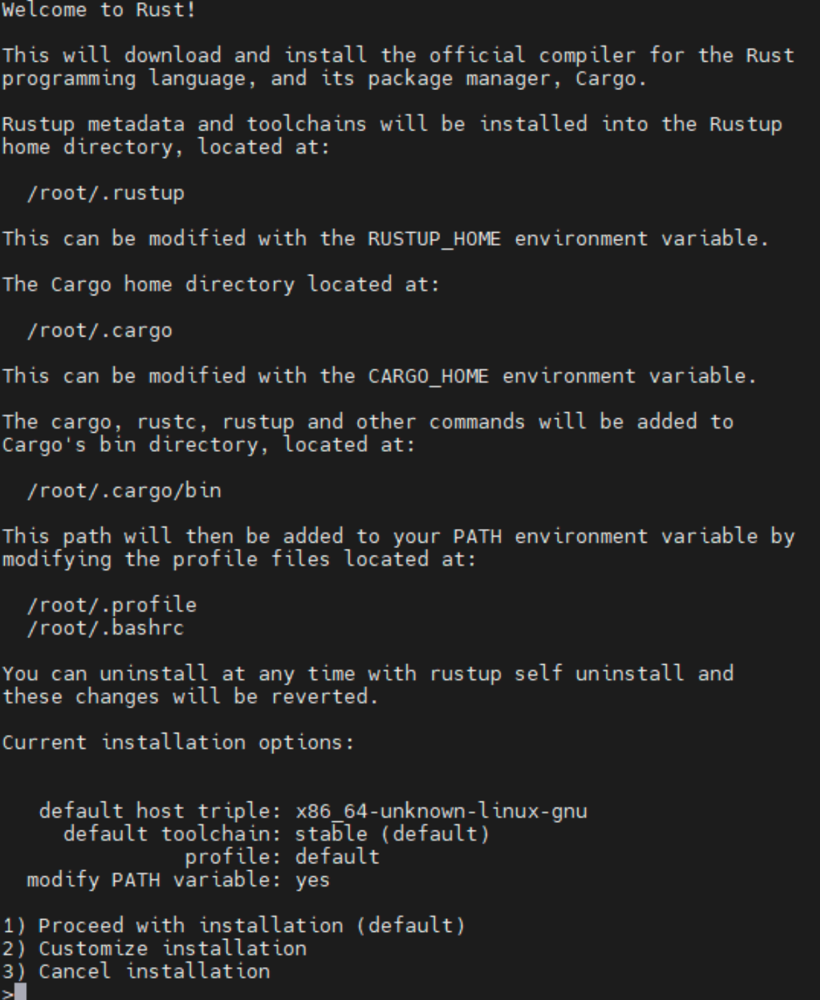

4. 安装 Rust 构建环境的依赖

   ```bash
   sudo apt install clang build-essential make
   ```

5. 安装 Rust & Cargo
   执行命令，根据交互完成安装

   ```bash
   curl --proto '=https' --tlsv1.2 -sSf https://sh.rustup.rs | sh
   ```

   直接回车保持 default 配置安装即可
   安装完成后使变更生效：

   ```bash
   source $HOME/.cargo/env
   ```

### 下载并编译 nearcore

1. 克隆 nearcore 仓库

   ```bash
   git clone https://github.com/near/nearcore
   ```

2. 进入仓库目录切换到所需要的 [commit](https://github.com/near/stakewars-iii/blob/main/commit.md)

   ```bash
   cd nearcore
   git fetch
   git checkout <commit>
   ```

   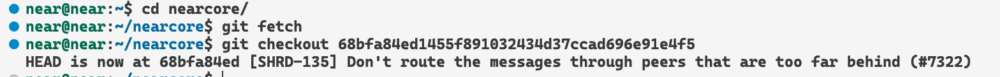

3. 编译 nearcore 二进制文件

   默认构建产物会在 `target/release/neard`

   ```bash
   cargo build -p neard --release --features shardnet
   ```

### 初始化工作目录

1. 通过 neard 生成默认配置文件

   ```bash
   ./target/release/neard --home ~/.near init --chain-id shardnet --download-genesis
   ```

   

2. 更换 config.json

   ```bash
   rm ~/.near/config.json
   wget -O ~/.near/config.json https://s3-us-west-1.amazonaws.com/build.nearprotocol.com/nearcore-deploy/shardnet/config.json
   ```

3. 获取快照

   * 在 2022 年 7 月 18 日对 SHARDNET 进行硬分叉后现在已经不需要获取快照

### 配置启动服务，启动节点

1. 配置服务

   ```bash
   sudo vi /etc/systemd/system/neard.service
   ```

   写入以下内容，<User> 替换为你的用户

   ```bash
   [Unit]
   Description=NEARd Daemon Service

   [Service]
   Type=simple
   User=<USER>
   #Group=near
   WorkingDirectory=/home/<USER>/.near
   ExecStart=/home/<USER>/nearcore/target/release/neard run
   Restart=on-failure
   RestartSec=30
   KillSignal=SIGINT
   TimeoutStopSec=45
   KillMode=mixed

   [Install]
   WantedBy=multi-user.target
   ```

   

2. 启动服务

   ```bash
   sudo systemctl enable neard
   sudo systemctl start neard
   ```

    > 如果您因为文件中的错误而需要对服务进行更改。它必须重新加载：

    ```bash
    sudo systemctl reload neard
    ```

3. 观看日志

   ```bash
   journalctl -n 100 -f -u neard
   ```

   以漂亮的打印输出日志

   ```
   sudo apt install ccze -y
   ```

   用颜色查看日志

   ```bash
   journalctl -n 100 -f -u neard | ccze -A
   ```

### 配置验证者

##### 本地授权钱包

需要在本地安装完整的访问密钥才能通过 NEAR-CLI 签署交易。

1. 运行以下命令：

   ```bash
   near login
   ```

   > 注意：此命令启动 Web 浏览器，允许在本地复制完整访问密钥的授权。

   

2. 授予对近 CLI 的访问权限

   

3. 授予后，你会看到这样的页面，回到控制台

   

4. 输入您的钱包并按 Enter

   

##### 检查 validator_key.json

1. 运行以下命令：

   ```bash
   cat ~/.near/validator_key.json
   ```

   > 注意：如果 validator_key.json 不存在，请按照以下步骤创建一个 `validator_key.json`

2. 生成密钥文件：

   ```bash
   near generate-key <pool_id>
   ```

   <pool_id> ---> xx.factory.shardnet.near WHERE xx is you pool name (xxx 就是第一大步中生成的 near shardnet 的钱包前缀)

3. 将生成的文件复制到 shardnet 文件夹：
   确保将 <pool_id> 替换为您的 accountId

   ```bash
   cp ~/.near-credentials/shardnet/YOUR_WALLET.json ~/.near/validator_key.json
   ```

4. 编辑 "account_id" => xx.factory.shardnet.near，其中 xx 是您的 PoolName(就是用 accountId 最前面的一部分，不要纠结)

5. 改变 `private_key`至 `secret_key`

   > 注意：account_id 必须与质押池合约名称匹配，否则您将无法签署区块。

   文件内容必须采用以下模式：

   ```json
   {
   "account_id": "xx.factory.shardnet.near",
   "public_key": "ed25519:HeaBJ3xLgvZacQWmEctTeUqyfSU4SDEnEwckWxd92W2G",
   "secret_key": "ed25519:****"
   }
   ```

6. 完成之后的目录结构大致就是：

   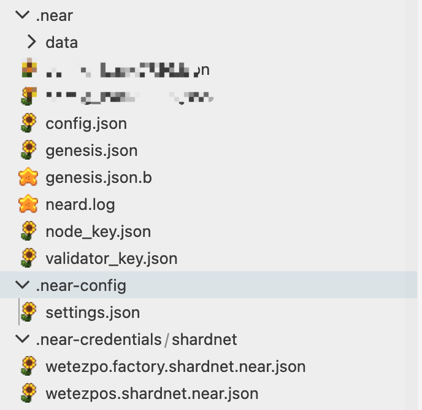

7. 等待区块同步完成变可以进行后续操作（如下图状态）

      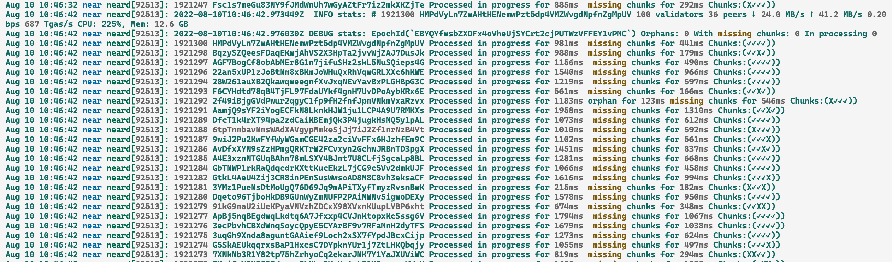

### 三，为你的验证人节点生成质押池并进行操作

[Deploy a new staking pool for your validator.](https://github.com/near/stakewars-iii/blob/main/challenges/003.md)

> 后续命令的 accountId 都会以 wetezpos.shardnet.near 为例

#### 部署质押池合约

##### 部署质押池

> 后续的 pool name 都推荐使用 accountId 自定义的部分，避免混淆

```bash
near call factory.shardnet.near create_staking_pool '{"staking_pool_id": "<pool name>", "owner_id": "<accountId>", "stake_public_key": "<public key>", "reward_fee_fraction": {"numerator": 5, "denominator": 100}, "code_hash":"DD428g9eqLL8fWUxv8QSpVFzyHi1Qd16P8ephYCTmMSZ"}' --accountId="<accountId>" --amount=30 --gas=300000000000000
```

**以 wetezpos.shardnet.near account 为例，则命令为：**

```bash
near call factory.shardnet.near create_staking_pool '{"staking_pool_id": "wetezpos", "owner_id": "wetezpos.shardnet.near", "stake_public_key": "<public key>", "reward_fee_fraction": {"numerator": 5, "denominator": 100}, "code_hash":"DD428g9eqLL8fWUxv8QSpVFzyHi1Qd16P8ephYCTmMSZ"}' --accountId="wetezpos.shardnet.near" --amount=30 --gas=300000000000000
```

* **Owner ID**: SHARDNET 账户 (例如。wetezpos.shardnet.near)
* **Public Key**: **validator_key.json** 中 public key 部分的内容。
* **5**: 创建的质押池会收取的费用 (例如。5 代表收取百分之 5 的费用).
* **Account Id**: 同 owner ID.

> 保证你的钱包至少有 30 Near 可用，这是存储所需的最低要求。例如 : near call wetezpos.factory.shardnet.near --amount 30 --accountId wetezpos.shardnet.near --gas=300000000000000

> 之后的 pool_id 都代表着 xxxx.factory.shardnet.near，例如 wetezpos.factory.shardnet.near

如果要更改池参数，例如在下面的示例中将收取的佣金金额更改为 1%，请使用以下命令：

```bash
near call <pool_id> update_reward_fee_fraction '{"reward_fee_fraction": {"numerator": 1, "denominator": 100}}' --accountId <account_id> --gas=300000000000000
```

#### 对节点做一些交互

##### 质押 Near

```bash
near call <pool_id> deposit_and_stake --amount <amount> --accountId <accountId> --gas=300000000000000
```

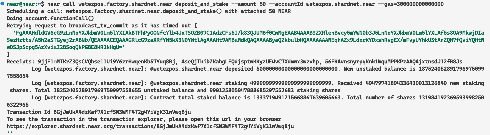

当你质押超过一定数量（目前是 580）的 Near 之后你应该可以在这个页面看到自己的节点了：[explorer](https://explorer.shardnet.near.org/nodes/validators)

##### 解除质押 NEAR

解除质押的 yoctoNEAR（10^-24 Near）数量

```bash
near call <pool_id> unstake '{"amount": "<amount yoctoNEAR>"}' --accountId <accountId> --gas=300000000000000
```

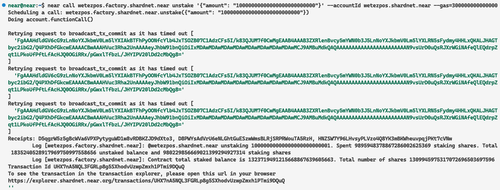

解除所有质押的命令：

```bash
near call <pool_id> unstake_all --accountId <accountId> --gas=300000000000000
```

##### 撤回质押

当执行了撤回质押的命令后，大概 2-3 个 epoch 后可以通过下面的命令取回到账户中

```bash
near call <pool_id> withdraw '{"amount": "<amount yoctoNEAR>"}' --accountId <accountId> --gas=300000000000000
```

取回所有资金：

```bash
near call <pool_id> withdraw_all --accountId <accountId> --gas=300000000000000
```

##### Ping

Ping 发出新的提案，并更新委托者的赌注余额。每个 epoch 都应该发出 ping 命令，以使报告的奖励保持最新。（在后续任务中会进行定时任务执行 ping）

```bash
near call <pool_id> ping '{}' --accountId <accountId> --gas=300000000000000
```

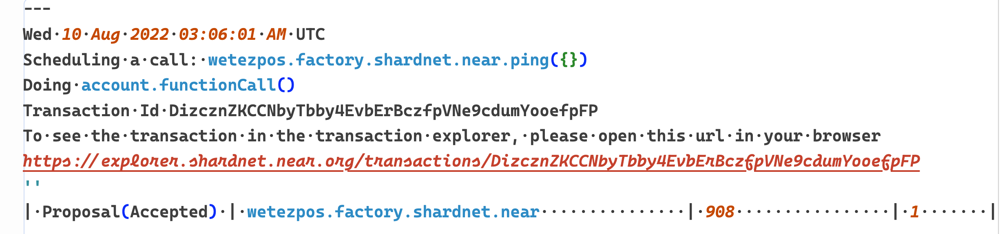

##### 获取账户所有金额：

```bash
near view <pool_id> get_account_total_balance '{"account_id": "<accountId>"}'
```

##### 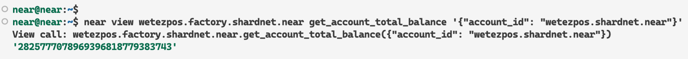

##### 获取质押的金额 :

```bash
near view <pool_id> get_account_staked_balance '{"account_id": "<accountId>"}' 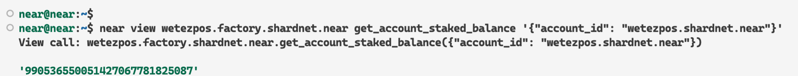
```


##### 获取未质押的金额：

```bash
near view <pool_id> get_account_unstaked_balance '{"account_id": "<accountId>"}'
```

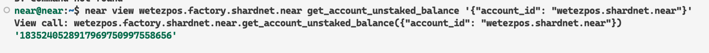


##### 查询是否可以提取金额

> 返回 true 的时候可以提取

```bash
near view <pool_id> is_account_unstaked_balance_available '{"account_id": "<accountId>"}'
```

##### 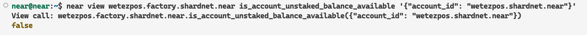

##### 暂停和恢复质押

###### 暂停

```bash
near call <pool_id> pause_staking '{}' --accountId <accountId>
```

###### 恢复

```bash
near call <pool_id> resume_staking '{}' --accountId <accountId>
```

# 四，监查节点状态

[Setup tools for monitoring node status.](https://github.com/near/stakewars-iii/blob/main/challenges/004.md)

> 用于监控节点状态的设置工具。在端口 3030 上安装和使用 RPC 以获取有用的信息以保持您的节点正常工作。

## RPC

只要该端口在节点防火墙中打开，网络中的任何节点都会在端口 3030 上提供 RPC 服务。NEAR-CLI 在后台使用 RPC 调用。RPC 的常见用途是检查验证者统计数据、节点版本和查看委托人权益，尽管它可用于与区块链、账户和合约进行整体交互。

在这里找到许多命令以及如何更详细地使用它们：

https://docs.near.org/api/rpc/introduction

### 通过一些工具帮助了解节点状态

#### 安装 jq

```bash
sudo apt install curl jq
```

#### 常用命令：

##### 查询节点版本：

```bash
curl -s http://127.0.0.1:3030/status | jq .version
```

##### 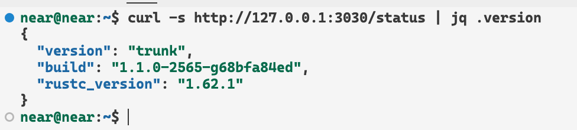

##### 检查委托和质押

```bash
near view <your pool>.factory.shardnet.near get_accounts '{"from_index": 0, "limit": 10}' --accountId <accountId>.shardnet.near
```

##### 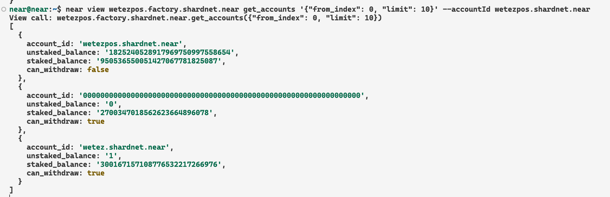

##### 查询被踢出验证者的原因

```bash
curl -s -d '{"jsonrpc": "2.0", "method": "validators", "id": "dontcare", "params": [null]}' -H 'Content-Type: application/json' 127.0.0.1:3030 | jq -c '.result.prev_epoch_kickout[] | select(.account_id | contains ("<POOL_ID>"))' | jq .reason
```

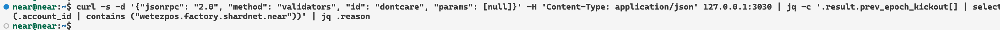

##### 查询生成的块/预期的块

```bash
curl -r -s -d '{"jsonrpc": "2.0", "method": "validators", "id": "dontcare", "params": [null]}' -H 'Content-Type: application/json' 127.0.0.1:3030 | jq -c '.result.current_validators[] | select(.account_id | contains ("POOL_ID"))'
```

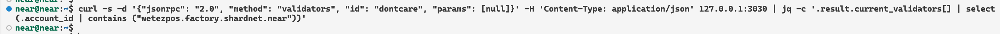